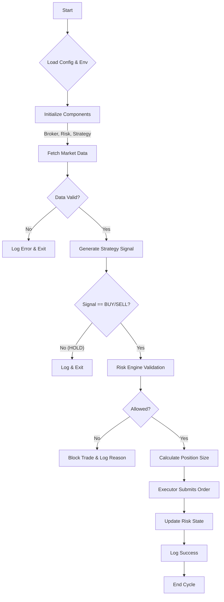

# Institutional Algorithmic Trading MVP

Wait... `schedule` is not imported inside `main.py`? I did verify it. Let's write the README.

## Overview
This is a Minimum Viable Product (MVP) of an automated institutional trading system built in Python. It includes modular architecture for Broker connectivity (Alpaca), Data fetching, Strategy execution (SMA Crossover), Risk Management, and Execution.

## Features
- **Broker Integration**: Connects to Alpaca (Paper Trading) for account info and order execution.
- **Data Layer**: Robust data fetching (OHLCV) with fallback to `yfinance`.
- **Strategy Engine**: Implements a simple Moving Average Crossover strategy (SMA 20/50).
- **Risk Management**: Enforces strict risk rules:
  - Max 5% capital per position
  - Max 2 trades per day
  - Daily Loss Limit (3%)
  - Stop Loss Logic
- **Execution Engine**: Handles order sizing and submission based on risk parameters.
- **Logging**: Comprehensive structured logging for auditing trading decisions.

## Project Structure
```
project_root/
│
├── config/             # Configuration & Environment Variables
├── broker/             # Broker Adapter (Alpaca)
├── data/               # Market Data Handlers
├── strategy/           # Trading Logic (SMA Crossover)
├── risk/               # Risk Engine & PnL Tracking
├── execution/          # Order Execution Logic
├── logs/               # Trading Logs
└── main.py             # Entry Point
```

## Installation

1. **Clone the repository** (or navigate to the project folder):
   ```bash
   cd algo_trading_mvp
   ```

2. **Create a Virtual Environment (Recommended):**
   ```bash
   python -m venv venv
   source venv/bin/activate  # On Mac/Linux
   venv\Scripts\activate     # On Windows
   ```

3. **Install Dependencies:**
   ```bash
   pip install -r requirements.txt
   ```

4. **Environment Setup:**
   Create a `.env` file in the root directory with your Alpaca API credentials:
   ```ini
   ALPACA_API_KEY=PK******************
   ALPACA_SECRET_KEY=********************************
   ALPACA_BASE_URL=https://paper-api.alpaca.markets
   ```

## Usage

**Run a single trading cycle:**
```bash
python main.py
```

**Run in continuous loop mode (e.g., daily check):**
```bash
python main.py --loop
```

## Internal Flow Diagram



## Logging
Logs are saved to `logs/trading.log` and printed to the console. They include structured information about every decision made by the system.

## Troubleshooting
- **ModuleNotFoundError**: Ensure you activated the virtual environment and installed requirements.
- **API Error**: Check your `.env` file and ensure keys are correct for Paper Trading.
